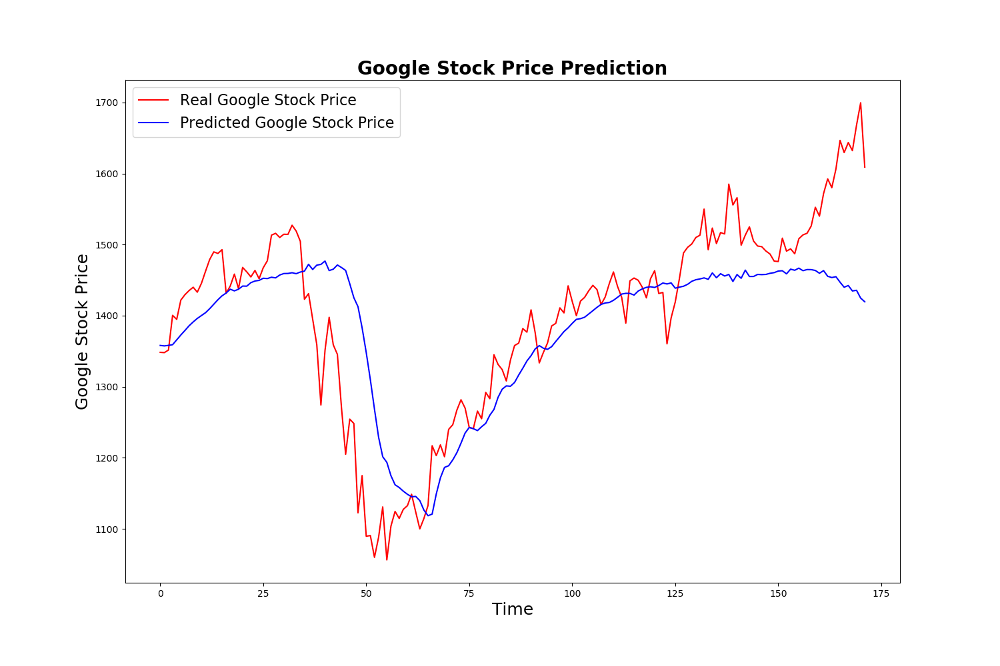
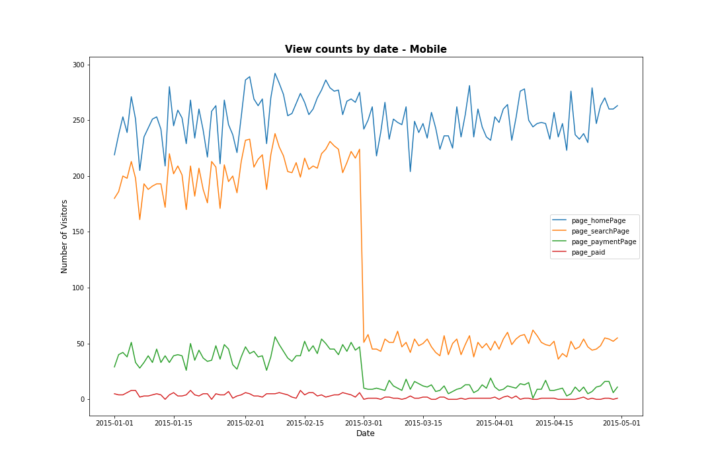

# Portfolio

---

## Predictive Analytics

- [Google Stock Price Trends Prediction with LSTM](https://github.com/norahyyu/Stock-price-prediction-using-LSTM/blob/master/Google%20Stock%20Price%20Trends%20Predictions%20using%20LSTM%20.ipynb)

Built a LSTM-based RNN model to capture the downward and upward trends of Google stock price. The model is robust and achieved 86.6% RSME. As we can see, the prediction lags behind the real values, because the model cannot react fast to non-linear changes. But on the other hand, the model reacts well to smooth changes and manages to follow upwards and downward trends.

- [Risk Prediction for Home Equity Line of Credit](https://github.com/norahyyu/python-project/blob/master/risk%20prediction%20for%20HELOC.ipynb)

This project aims at developing a predictive model and a decision support system (DSS) that evaluates the risk of Home Equity Line of Credit (HELOC) applications.

---

## Social Media Analytics
- [Funnel Analysis for E-commerce Website](https://github.com/norahyyu/Funnel-analysis/blob/master/Funnel%20analysis.ipynb)

Conducted funnel analysis to understand where/when our users abandon the website and get insights on user behavior and on ways to improve the user experience. 

- [Food Trend Detection](https://github.com/norahyyu/NLP/blob/master/Detection%20of%20Emerging%20Food%20Trends.pdf)

Early detection of emerging food trends can translate into great business opportunities. Today, a lot of food-related discussions occur on social media platforms such as Twitter and Facebook.The purpose of this project is to constructing time series of potential food trends using Facebook post data to help retailers see the rise and fall of certain categories of food.

---

## Conjoint Analysis

- [Toy Horse Conjoint Experiment](https://github.com/norahyyu/Conjoint-Analysis/blob/master/conjoint%20analysis.pdf)

Understand what type of toy horse do the customers prefer and perform market simulation based on different product portfolios.

---

## Dashboard Design

- [Profitability of Supermarket Sales in 2017](https://public.tableau.com/profile/norah.yu#!/vizhome/profitabilitybycustomer/2017ProfitAnalysis)

---

---

<!-- Remove above link if you don't want to attibute -->
